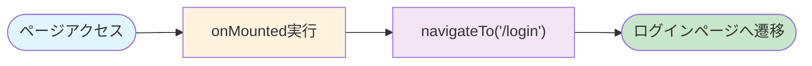
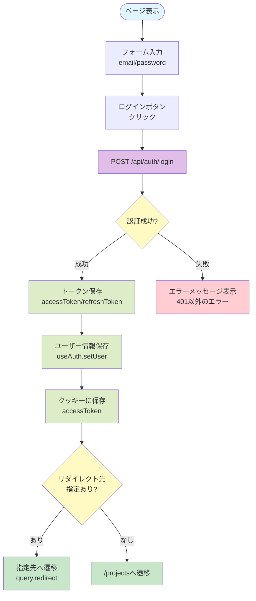
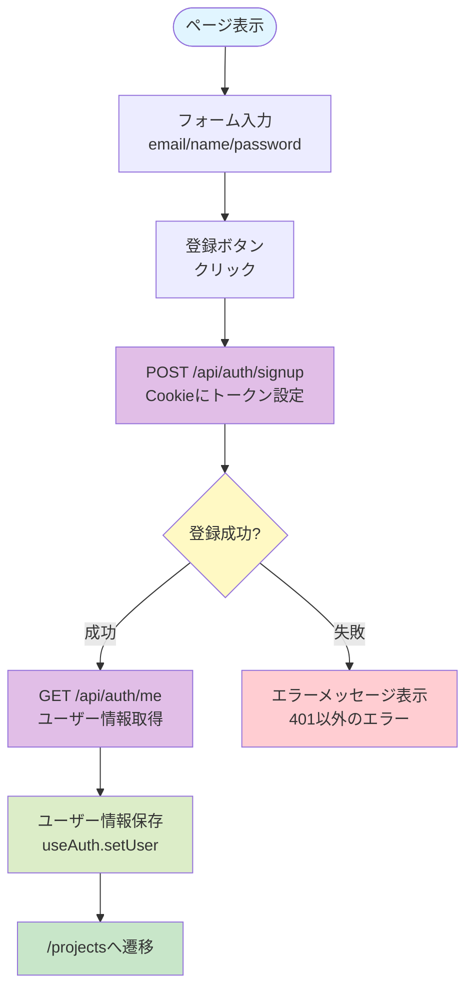
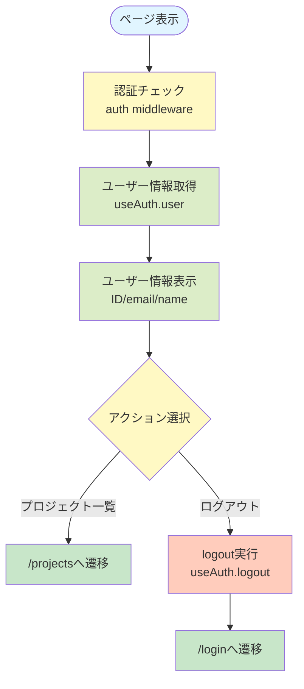
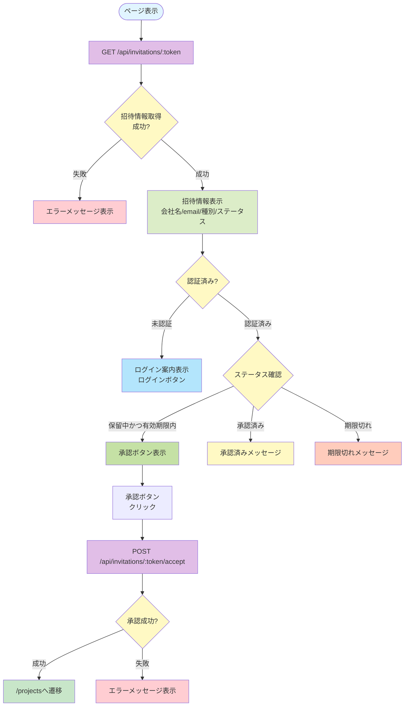

# 認証・招待系ページ仕様書

## 概要

認証と招待機能に関するページの機能仕様を記載します。

---

## 1. トップページ (`/`)

### 基本情報

- **ページパス**: `/`
- **ファイル**: `pages/index.vue`
- **ミドルウェア**: なし（自動リダイレクト）

### 主要機能

- ログインページへの自動リダイレクト

### 処理フロー



### 実装詳細

- クライアントサイドでのみリダイレクト処理を実行
- `onMounted`フック内で`navigateTo('/login')`を呼び出し
- リダイレクト中は「リダイレクト中...」というメッセージを表示

---

## 2. ログインページ (`/login`)

### 基本情報

- **ページパス**: `/login`
- **ファイル**: `pages/login.vue`
- **ミドルウェア**: `guest`（未認証ユーザーのみアクセス可能）
- **レイアウト**: `AuthLayout`

### 主要機能

- メールアドレスとパスワードによるログイン
- エラーメッセージの表示
- サインアップページへのリンク
- リダイレクト先の指定（`redirect`クエリパラメータ）

### 処理フロー



### API呼び出し

#### POST /api/auth/login

**リクエスト**:
```json
{
  "email": "user@example.com",
  "password": "password123"
}
```

**レスポンス**:
```json
{
  "accessToken": "jwt_token",
  "refreshToken": "refresh_token",
  "user": {
    "id": "user_id",
    "email": "user@example.com",
    "name": "ユーザー名"
  }
}
```

### 権限・アクセス制御

- 未認証ユーザーのみアクセス可能（`guest`ミドルウェア）
- 認証済みユーザーがアクセスした場合は自動的にリダイレクト

### UI要素

- **フォーム項目**:
  - メールアドレス（必須、email型）
  - パスワード（必須、password型）
- **ボタン**: ログインボタン（ローディング中は無効化）
- **エラーハンドリング**: エラー時は赤背景でメッセージを表示
- **リンク**: サインアップページへのリンク

### エラーハンドリング

- 401エラーの場合はエラーメッセージを表示しない（ミドルウェアでリダイレクトされるため）
- その他のエラーはエラーメッセージを表示

---

## 3. サインアップページ (`/signup`)

### 基本情報

- **ページパス**: `/signup`
- **ファイル**: `pages/signup.vue`
- **ミドルウェア**: `guest`（未認証ユーザーのみアクセス可能）
- **レイアウト**: `AuthLayout`

### 主要機能

- 新規ユーザー登録
- メールアドレス、名前、パスワードの入力
- ログインページへのリンク

### 処理フロー



### API呼び出し

#### POST /api/auth/signup

**リクエスト**:
```json
{
  "email": "user@example.com",
  "name": "ユーザー名",
  "password": "password123"
}
```

**レスポンス**: 成功時、Cookieにトークンが設定される

#### GET /api/auth/me

**レスポンス**:
```json
{
  "id": "user_id",
  "email": "user@example.com",
  "name": "ユーザー名"
}
```

### 権限・アクセス制御

- 未認証ユーザーのみアクセス可能（`guest`ミドルウェア）

### UI要素

- **フォーム項目**:
  - メールアドレス（必須、email型）
  - 名前（必須、text型）
  - パスワード（必須、password型、8文字以上）
- **ボタン**: 登録ボタン（ローディング中は無効化）
- **エラーハンドリング**: エラー時は赤背景でメッセージを表示
- **リンク**: ログインページへのリンク

### エラーハンドリング

- 401エラーの場合はエラーメッセージを表示しない
- その他のエラーはエラーメッセージを表示

---

## 4. ダッシュボード (`/dashboard`)

### 基本情報

- **ページパス**: `/dashboard`
- **ファイル**: `pages/dashboard.vue`
- **ミドルウェア**: `auth`（認証必須）
- **レイアウト**: `DashboardLayout`

### 主要機能

- ユーザー情報の表示
- クイックアクション（プロジェクト一覧へのリンク、ログアウト）

### 処理フロー



### API呼び出し

- ユーザー情報は`useAuth()` composableから取得（既に認証時に取得済み）

### 権限・アクセス制御

- 認証済みユーザーのみアクセス可能（`auth`ミドルウェア）

### UI要素

- **カード**: ユーザー情報カード（ID、メールアドレス、名前）
- **クイックアクションカード**:
  - プロジェクト一覧へのリンクボタン
  - ログアウトボタン（削除スタイル）

### エラーハンドリング

- 認証エラーの場合は自動的にログインページへリダイレクト

---

## 5. 招待承認ページ (`/invitations/[token]`)

### 基本情報

- **ページパス**: `/invitations/:token`
- **ファイル**: `pages/invitations/[token].vue`
- **ミドルウェア**: なし（認証不要だが、承認には認証が必要）
- **レイアウト**: `AuthLayout`

### 主要機能

- 招待情報の表示
- 招待の承認
- 招待ステータスの確認（保留中、承認済み、期限切れなど）
- 未認証ユーザーへのログイン案内

### 処理フロー



### API呼び出し

#### GET /api/invitations/:token

**レスポンス**:
```json
{
  "id": "invitation_id",
  "email": "user@example.com",
  "companyName": "会社名",
  "userType": 1,
  "status": "PENDING",
  "expiresAt": "2024-12-31T23:59:59Z"
}
```

#### POST /api/invitations/:token/accept

**レスポンス**: 成功時、会社への所属が作成される

### 権限・アクセス制御

- ページ自体は認証不要でアクセス可能
- 招待の承認には認証が必要
- 未認証ユーザーはログインページへのリンクが表示される

### UI要素

- **招待情報カード**:
  - 会社名
  - メールアドレス
  - ユーザー種別（バッジ表示）
  - ステータス（バッジ表示）
  - 有効期限
- **ボタン**:
  - ログインボタン（未認証時）
  - 承認ボタン（保留中かつ有効期限内の場合）
- **メッセージ**:
  - 承認済みメッセージ
  - 期限切れメッセージ
  - エラーメッセージ

### エラーハンドリング

- 招待情報取得失敗時はエラーメッセージを表示
- 承認失敗時はエラーメッセージを表示

### ユーザー種別とステータス

**ユーザー種別**:
- 1: 管理者（defaultバッジ）
- 2: メンバー（secondaryバッジ）
- 3: パートナー（outlineバッジ）
- 4: 顧客（outlineバッジ）

**ステータス**:
- PENDING: 保留中（defaultバッジ）
- ACCEPTED: 承認済み（secondaryバッジ）
- REJECTED: 拒否済み（destructiveバッジ）
- EXPIRED: 期限切れ（outlineバッジ）

