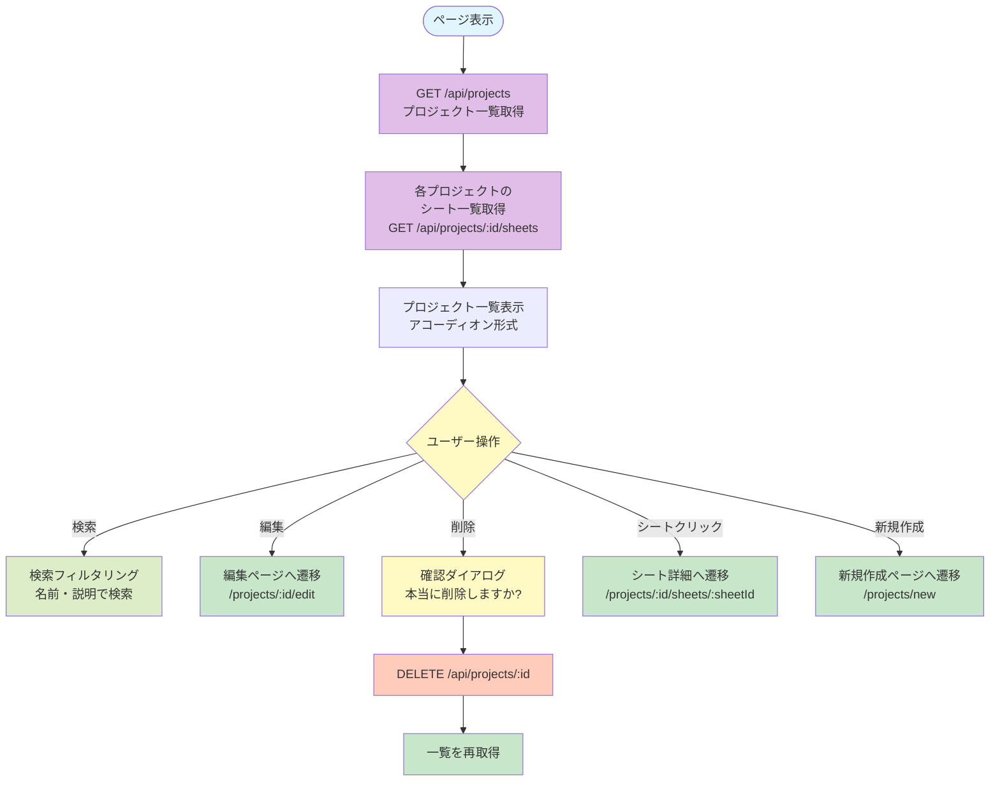
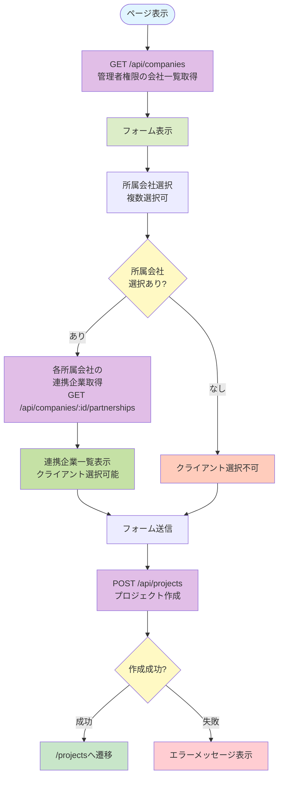
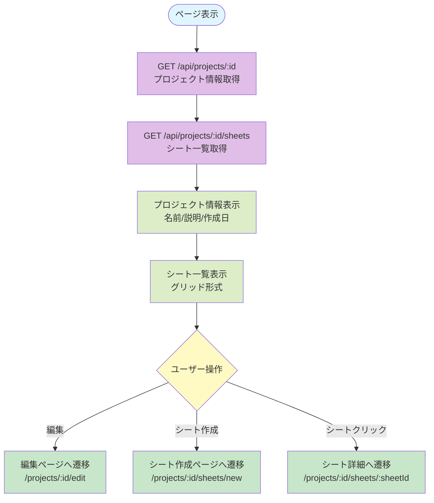
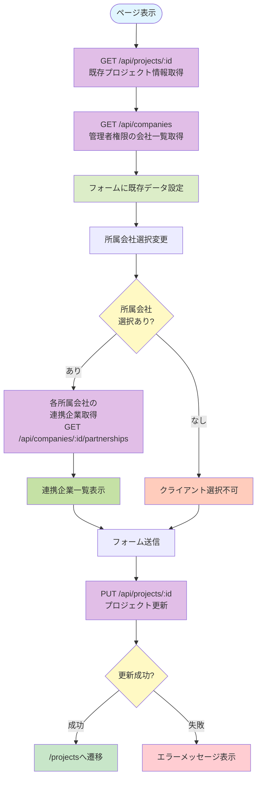

# プロジェクト管理系ページ仕様書

## 概要

プロジェクトの作成、一覧表示、詳細表示、編集に関するページの機能仕様を記載します。

---

## 1. プロジェクト一覧 (`/projects`)

### 基本情報

- **ページパス**: `/projects`
- **ファイル**: `pages/projects/index.vue`
- **ミドルウェア**: `auth`（認証必須）
- **レイアウト**: `DashboardLayout`

### 主要機能

- プロジェクト一覧の表示
- プロジェクトの検索
- プロジェクトの削除
- プロジェクト編集へのリンク
- シート一覧の表示（アコーディオン形式）
- 新規プロジェクト作成へのリンク（管理者のみ）

### 処理フロー



### API呼び出し

#### GET /api/projects

**レスポンス**:
```json
[
  {
    "id": "project_id",
    "name": "プロジェクト名",
    "description": "説明",
    "companyIds": ["company_id1", "company_id2"],
    "clientCompanyIds": ["client_company_id"],
    "createdAt": "2024-01-01T00:00:00Z"
  }
]
```

#### GET /api/projects/:id/sheets

各プロジェクトのシート一覧を取得（プロジェクトごとに個別に呼び出し）

**レスポンス**:
```json
[
  {
    "id": "sheet_id",
    "name": "シート名",
    "description": "説明"
  }
]
```

#### DELETE /api/projects/:id

プロジェクトを削除

### 権限・アクセス制御

- 認証済みユーザーのみアクセス可能
- 新規作成ボタンは、ユーザーが管理者権限を持つ会社が1つ以上ある場合のみ表示
- 編集・削除ボタンは、プロジェクトの編集権限がある場合のみ表示
  - プライベートプロジェクト: 作成者のみ編集可能
  - 社内公開プロジェクト: プロジェクトに所属する会社のいずれかで管理者権限を持つユーザーのみ編集可能

### UI要素

- **検索ボックス**: プロジェクト名・説明で検索可能
- **アコーディオン**: 各プロジェクトを展開可能
- **プロジェクトカード**:
  - プロジェクト名（詳細ページへのリンク）
  - 説明
  - 作成日
  - シート数（バッジ表示）
  - 編集ボタン（権限がある場合）
  - 削除ボタン（権限がある場合）
- **シート一覧**: アコーディオン内にシート名をバッジ形式で表示（クリックでシート詳細へ遷移）
- **新規作成ボタン**: 管理者のみ表示

### エラーハンドリング

- プロジェクト取得失敗時はエラーメッセージを表示
- 削除失敗時はアラートでエラーメッセージを表示

---

## 2. プロジェクト作成 (`/projects/new`)

### 基本情報

- **ページパス**: `/projects/new`
- **ファイル**: `pages/projects/new.vue`
- **ミドルウェア**: `auth`（認証必須）
- **レイアウト**: `DashboardLayout`

### 主要機能

- 新規プロジェクトの作成
- 公開範囲の設定（プライベート、社内公開、公開）
- 所属会社の選択（複数選択可）
- クライアント会社の選択（連携企業から選択、複数選択可）

### 処理フロー



### API呼び出し

#### GET /api/companies

管理者権限を持つ会社一覧を取得

**レスポンス**:
```json
[
  {
    "id": "company_id",
    "name": "会社名",
    "userType": 1
  }
]
```

#### GET /api/companies/:id/partnerships

選択された所属会社の連携企業一覧を取得（所属会社ごとに個別に呼び出し）

**レスポンス**:
```json
[
  {
    "id": "partnership_id",
    "partnerCompanyId": "partner_company_id",
    "partnerCompanyName": "連携企業名"
  }
]
```

#### POST /api/projects

**リクエスト**:
```json
{
  "name": "プロジェクト名",
  "description": "説明（任意）",
  "visibility": "PRIVATE" | "COMPANY_INTERNAL" | "PUBLIC",
  "companyIds": ["company_id1", "company_id2"],
  "clientCompanyIds": ["client_company_id1"]
}
```

**レスポンス**: 作成されたプロジェクト情報

### 権限・アクセス制御

- 認証済みユーザーのみアクセス可能
- 管理者権限を持つ会社が1つ以上ある場合のみ、所属会社として選択可能

### UI要素

- **フォーム項目**:
  - 名前（必須、text型）
  - 説明（任意、textarea型）
  - 公開範囲（必須、select型）
    - PRIVATE: プライベート
    - COMPANY_INTERNAL: 社内公開
    - PUBLIC: 公開
  - 所属会社（複数選択、checkbox型）
  - クライアント（複数選択、checkbox型、所属会社選択後に表示）
- **ボタン**:
  - 登録ボタン
  - キャンセルボタン（プロジェクト一覧へ戻る）

### エラーハンドリング

- 会社一覧取得失敗時はエラーメッセージを表示
- 連携企業取得失敗時はエラーメッセージを表示
- プロジェクト作成失敗時はエラーメッセージを表示

---

## 3. プロジェクト詳細 (`/projects/:id`)

### 基本情報

- **ページパス**: `/projects/:id`
- **ファイル**: `pages/projects/[id]/index.vue`
- **ミドルウェア**: `auth`（認証必須）
- **レイアウト**: `DashboardLayout`

### 主要機能

- プロジェクト情報の表示
- シート一覧の表示
- プロジェクト編集へのリンク（権限がある場合）
- シート作成へのリンク（権限がある場合）
- シート詳細への遷移

### 処理フロー



### API呼び出し

#### GET /api/projects/:id

**レスポンス**:
```json
{
  "id": "project_id",
  "name": "プロジェクト名",
  "description": "説明",
  "companyIds": ["company_id1"],
  "clientCompanyIds": ["client_company_id"],
  "createdAt": "2024-01-01T00:00:00Z"
}
```

#### GET /api/projects/:id/sheets

**レスポンス**:
```json
[
  {
    "id": "sheet_id",
    "name": "シート名",
    "description": "説明"
  }
]
```

### 権限・アクセス制御

- 認証済みユーザーのみアクセス可能
- 編集・シート作成ボタンは、プロジェクトの編集権限がある場合のみ表示
  - プライベートプロジェクト: 作成者のみ編集可能
  - 社内公開プロジェクト: プロジェクトに所属する会社のいずれかで管理者権限を持つユーザーのみ編集可能

### UI要素

- **プロジェクト情報カード**:
  - 説明
  - 作成日
- **シート一覧カード**:
  - シート一覧をグリッド形式で表示
  - 各シートカード（クリックでシート詳細へ遷移）
    - シート名
    - 説明
- **アクションボタン**（権限がある場合）:
  - 編集ボタン
  - シート作成ボタン
- **モバイルメニュー**: 小画面ではハンバーガーメニューでアクションを表示

### エラーハンドリング

- プロジェクト取得失敗時はエラーメッセージを表示
- シート一覧取得失敗時はエラーメッセージを表示

---

## 4. プロジェクト編集 (`/projects/:id/edit`)

### 基本情報

- **ページパス**: `/projects/:id/edit`
- **ファイル**: `pages/projects/[id]/edit.vue`
- **ミドルウェア**: `auth`（認証必須）
- **レイアウト**: `DashboardLayout`

### 主要機能

- プロジェクト情報の編集
- 公開範囲の変更
- 所属会社の変更（複数選択可）
- クライアント会社の変更（連携企業から選択、複数選択可）

### 処理フロー



### API呼び出し

#### GET /api/projects/:id

既存のプロジェクト情報を取得

#### GET /api/companies

管理者権限を持つ会社一覧を取得

#### GET /api/companies/:id/partnerships

選択された所属会社の連携企業一覧を取得

#### PUT /api/projects/:id

**リクエスト**:
```json
{
  "name": "プロジェクト名",
  "description": "説明（任意）",
  "visibility": "PRIVATE" | "COMPANY_INTERNAL" | "PUBLIC",
  "companyIds": ["company_id1", "company_id2"],
  "clientCompanyIds": ["client_company_id1"]
}
```

### 権限・アクセス制御

- 認証済みユーザーのみアクセス可能
- プロジェクトの編集権限がない場合は403エラーをスロー
  - プライベートプロジェクト: 作成者のみ編集可能
  - 社内公開プロジェクト: プロジェクトに所属する会社のいずれかで管理者権限を持つユーザーのみ編集可能

### UI要素

- **フォーム項目**:
  - 名前（必須、text型）
  - 説明（任意、textarea型）
  - 公開範囲（必須、select型）
  - 所属会社（複数選択、checkbox型）
  - クライアント（複数選択、checkbox型、所属会社選択後に表示）
- **ボタン**:
  - 更新ボタン
  - キャンセルボタン（プロジェクト一覧へ戻る）

### エラーハンドリング

- プロジェクト取得失敗時はエラーメッセージを表示
- 会社一覧取得失敗時はエラーメッセージを表示
- 連携企業取得失敗時はエラーメッセージを表示
- 権限がない場合は403エラーをスロー
- プロジェクト更新失敗時はエラーメッセージを表示

