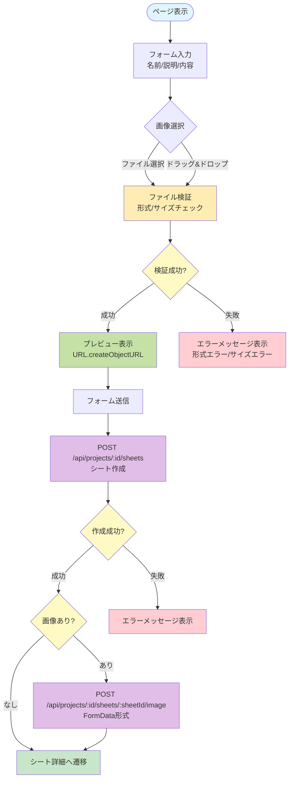
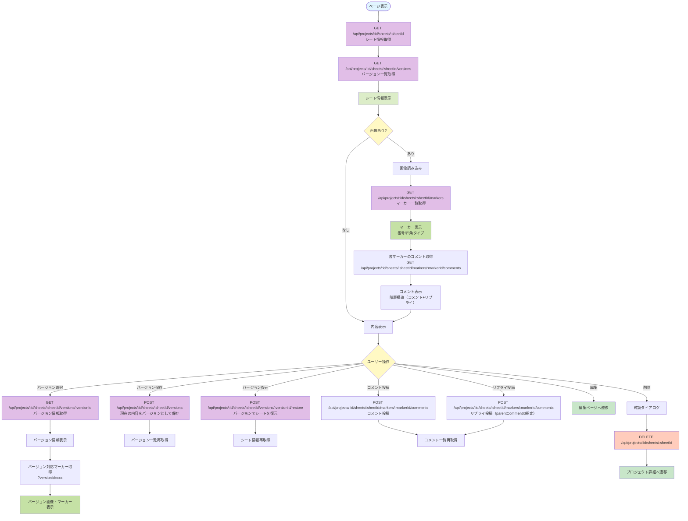
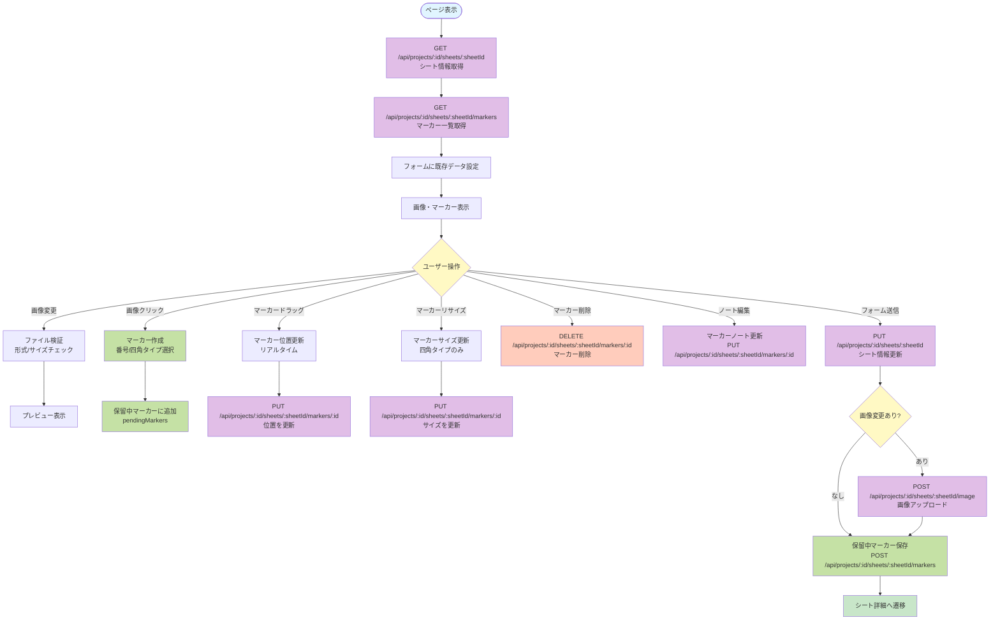

# シート管理系ページ仕様書

## 概要

シートの作成、詳細表示、編集に関するページの機能仕様を記載します。シートには画像アップロード、マーカー機能、バージョン管理などの機能が含まれます。

---

## 1. シート作成 (`/projects/:id/sheets/new`)

### 基本情報

- **ページパス**: `/projects/:id/sheets/new`
- **ファイル**: `pages/projects/[id]/sheets/new.vue`
- **ミドルウェア**: `auth`（認証必須）
- **レイアウト**: なし（独自スタイル）

### 主要機能

- 新規シートの作成
- 画像のアップロード（ドラッグ&ドロップ対応）
- 画像プレビュー

### 処理フロー



### API呼び出し

#### POST /api/projects/:id/sheets

**リクエスト**:
```json
{
  "name": "シート名",
  "description": "説明（任意）",
  "content": "内容（任意）"
}
```

**レスポンス**:
```json
{
  "id": "sheet_id",
  "name": "シート名",
  "description": "説明",
  "content": "内容",
  "imageUrl": null
}
```

#### POST /api/projects/:id/sheets/:sheetId/image

**リクエスト**: FormData形式
- `file`: 画像ファイル（png/jpeg/webp/gif、最大5MB）

**レスポンス**: 画像アップロード成功

### 権限・アクセス制御

- 認証済みユーザーのみアクセス可能
- 管理者またはメンバー権限が必要（403エラーをスロー）

### UI要素

- **フォーム項目**:
  - 名前（必須、text型）
  - 説明（任意、textarea型）
  - 内容（任意、textarea型）
  - 画像（任意、file型、ドラッグ&ドロップ対応）
- **画像アップロード**:
  - ドラッグ&ドロップエリア
  - ファイル選択ボタン
  - プレビュー表示
- **ボタン**:
  - 作成ボタン
  - キャンセルボタン（プロジェクト詳細へ戻る）

### エラーハンドリング

- ファイル形式エラー: 「対応形式は png/jpeg/webp/gif です」
- ファイルサイズエラー: 「ファイルサイズは5MB以下にしてください」
- シート作成失敗時はエラーメッセージを表示
- 画像アップロード失敗時はエラーメッセージを表示

### 画像検証

- **対応形式**: png, jpeg, webp, gif
- **最大サイズ**: 5MB
- **検証タイミング**: ファイル選択時、ドラッグ&ドロップ時

---

## 2. シート詳細・閲覧 (`/projects/:id/sheets/:sheetId`)

### 基本情報

- **ページパス**: `/projects/:id/sheets/:sheetId`
- **ファイル**: `pages/projects/[id]/sheets/[sheetId]/index.vue`
- **ミドルウェア**: `auth`（認証必須）
- **レイアウト**: なし（独自スタイル）

### 主要機能

- シート情報の表示
- 画像の表示
- マーカーの表示（読み取り専用）
- マーカーへのコメント機能（コメント投稿・リプライ、1階層まで）
- バージョン管理（バージョン一覧、選択、復元）
- シートの削除（管理者・メンバーのみ）
- シート編集へのリンク（管理者・メンバーのみ）

### 処理フロー



### API呼び出し

#### GET /api/projects/:id/sheets/:sheetId

**レスポンス**:
```json
{
  "id": "sheet_id",
  "name": "シート名",
  "description": "説明",
  "content": "内容",
  "imageUrl": "画像URL",
  "createdAt": "2024-01-01T00:00:00Z",
  "updatedAt": "2024-01-01T00:00:00Z"
}
```

#### GET /api/projects/:id/sheets/:sheetId/versions

**レスポンス**:
```json
[
  {
    "id": "version_id",
    "versionName": "バージョン名",
    "createdAt": "2024-01-01T00:00:00Z"
  }
]
```

#### GET /api/projects/:id/sheets/:sheetId/markers

**クエリパラメータ**:
- `versionId` (任意): バージョンIDを指定すると、そのバージョンのマーカーを取得

**レスポンス**:
```json
[
  {
    "id": "marker_id",
    "type": "number" | "square",
    "x": 50,
    "y": 50,
    "width": 10,
    "height": 10,
    "note": "メモ",
    "createdAt": "2024-01-01T00:00:00Z"
  }
]
```

#### GET /api/projects/:id/sheets/:sheetId/versions/:versionId

**レスポンス**:
```json
{
  "id": "version_id",
  "versionName": "バージョン名",
  "imageUrl": "画像URL",
  "content": "内容",
  "createdAt": "2024-01-01T00:00:00Z"
}
```

#### POST /api/projects/:id/sheets/:sheetId/versions

現在のシート内容をバージョンとして保存

#### POST /api/projects/:id/sheets/:sheetId/versions/:versionId/restore

選択したバージョンでシートを復元

#### DELETE /api/projects/:id/sheets/:sheetId

シートを削除

#### GET /api/projects/:id/sheets/:sheetId/markers/:markerId/comments

マーカーのコメント一覧を取得（階層構造で返却）

**レスポンス**:
```json
[
  {
    "id": "comment_id",
    "markerId": "marker_id",
    "userId": "user_id",
    "userName": "ユーザー名",
    "parentCommentId": null,
    "content": "コメント内容",
    "createdAt": "2024-01-01T00:00:00Z",
    "updatedAt": "2024-01-01T00:00:00Z",
    "replies": [
      {
        "id": "reply_id",
        "markerId": "marker_id",
        "userId": "user_id",
        "userName": "ユーザー名",
        "parentCommentId": "comment_id",
        "content": "リプライ内容",
        "createdAt": "2024-01-01T00:00:00Z",
        "updatedAt": "2024-01-01T00:00:00Z",
        "replies": []
      }
    ]
  }
]
```

#### POST /api/projects/:id/sheets/:sheetId/markers/:markerId/comments

コメントまたはリプライを投稿

**リクエスト**:
```json
{
  "content": "コメント内容",
  "parentCommentId": null  // リプライの場合は親コメントID、トップレベルコメントの場合はnull
}
```

**レスポンス**: 作成されたコメント情報

**制約**:
- リプライにリプライはできない（`parentCommentId`が`null`でないコメントにはリプライ不可）
- 認証済みユーザー全員がコメント投稿可能

### 権限・アクセス制御

- 認証済みユーザーのみアクセス可能
- 編集・削除ボタンは、管理者またはメンバー権限がある場合のみ表示

### UI要素

- **シート情報**:
  - シート名
  - 説明
  - 画像（マーカー付き）
  - マーカーテーブル（番号タイプのマーカーのみ）
  - 作成日
  - 更新日
- **バージョン管理セクション**:
  - バージョン保存ボタン（管理者・メンバーのみ）
  - バージョン選択ドロップダウン
  - バージョン情報表示（選択時）
  - バージョン復元ボタン（管理者・メンバーのみ、バージョン選択時）
- **アクションボタン**（管理者・メンバーのみ）:
  - 編集ボタン
  - 削除ボタン
- **マーカー表示**:
  - 番号タイプ: 円形バッジで番号を表示（①、②、③...）
  - 四角タイプ: 四角形の枠線で表示
  - マーカーは登録順（作成日時順）でソート
  - マーカーにホバーするとハイライト表示
- **コメント機能**:
  - 各マーカーに対してコメントセクションを表示
  - コメント一覧（階層構造: コメント + リプライ）
  - コメント投稿フォーム
  - リプライ投稿フォーム（トップレベルコメントのみ）
  - リプライは「L」プレフィックス付きでインデント表示
  - リプライにリプライは不可

### エラーハンドリング

- シート取得失敗時はエラーメッセージを表示
- バージョン取得失敗時はコンソールにエラーを出力
- マーカー取得失敗時はコンソールにエラーを出力
- コメント取得失敗時はコンソールにエラーを出力
- コメント投稿失敗時はアラートでエラーメッセージを表示
- リプライ投稿失敗時はアラートでエラーメッセージを表示
- バージョン保存失敗時はアラートでエラーメッセージを表示
- バージョン復元失敗時はアラートでエラーメッセージを表示
- 削除失敗時はアラートでエラーメッセージを表示

### マーカー機能

- **マーカータイプ**:
  - `number`: 番号マーカー（①、②、③...）
  - `square`: 四角マーカー（サイズ可変）
- **表示方法**:
  - 画像上に絶対配置で表示
  - 座標はパーセンテージ（0-100%）で管理
  - 番号マーカーは登録順で番号を自動割り当て
- **マーカーテーブル**:
  - 番号タイプのマーカーのみをテーブル形式で表示
  - 番号とメモを表示（読み取り専用）
- **マーカーコメント**:
  - 各マーカーに対してコメントを投稿可能
  - コメントに対して1階層のリプライが可能（リプライにリプライは不可）
  - コメントは階層構造で表示（コメント → リプライ）
  - 認証済みユーザー全員がコメント投稿可能

### バージョン管理

- **バージョン保存**: 現在のシート内容（画像、内容、マーカー）をバージョンとして保存
- **バージョン選択**: ドロップダウンからバージョンを選択すると、そのバージョンの画像・内容・マーカーを表示
- **バージョン復元**: 選択したバージョンで現在のシートを上書き
- **現在のバージョン**: バージョン未選択時は、最新のシート内容を表示

---

## 3. シート編集 (`/projects/:id/sheets/:sheetId/edit`)

### 基本情報

- **ページパス**: `/projects/:id/sheets/:sheetId/edit`
- **ファイル**: `pages/projects/[id]/sheets/[sheetId]/edit.vue`
- **ミドルウェア**: `auth`（認証必須）
- **レイアウト**: なし（独自スタイル）

### 主要機能

- シート情報の編集
- 画像のアップロード・変更（ドラッグ&ドロップ対応）
- マーカーの作成・編集・削除
- マーカーノートの編集

### 処理フロー



### API呼び出し

#### GET /api/projects/:id/sheets/:sheetId

既存のシート情報を取得

#### GET /api/projects/:id/sheets/:sheetId/markers

既存のマーカー一覧を取得

#### PUT /api/projects/:id/sheets/:sheetId

**リクエスト**:
```json
{
  "name": "シート名",
  "description": "説明（任意）",
  "content": "内容（任意）"
}
```

#### POST /api/projects/:id/sheets/:sheetId/image

画像をアップロード（FormData形式）

#### POST /api/projects/:id/sheets/:sheetId/markers

**リクエスト**:
```json
{
  "type": "number" | "square",
  "x": 50,
  "y": 50,
  "width": 10,
  "height": 10,
  "note": "メモ（任意）"
}
```

**レスポンス**: 作成されたマーカー情報

#### PUT /api/projects/:id/sheets/:sheetId/markers/:markerId

**リクエスト**:
```json
{
  "x": 50,
  "y": 50,
  "width": 10,
  "height": 10,
  "note": "メモ（任意）"
}
```

#### DELETE /api/projects/:id/sheets/:sheetId/markers/:markerId

マーカーを削除

### 権限・アクセス制御

- 認証済みユーザーのみアクセス可能
- 管理者またはメンバー権限が必要（403エラーをスロー）

### UI要素

- **フォーム項目**:
  - 名前（必須、text型）
  - 説明（任意、textarea型）
  - 内容（任意、textarea型）
  - 画像（任意、file型、ドラッグ&ドロップ対応）
- **マーカー編集機能**:
  - マーカータイプ選択（番号/四角）
  - 画像上でクリックしてマーカー作成
  - マーカーのドラッグで位置変更
  - 四角マーカーのリサイズハンドルでサイズ変更
  - マーカーにホバーで削除ボタン表示
  - マーカーテーブルでノート編集
- **ボタン**:
  - 更新ボタン
  - キャンセルボタン（シート詳細へ戻る）

### エラーハンドリング

- シート取得失敗時はエラーメッセージを表示
- マーカー取得失敗時はコンソールにエラーを出力
- ファイル検証エラーはエラーメッセージを表示
- シート更新失敗時はエラーメッセージを表示
- 画像アップロード失敗時はエラーメッセージを表示
- マーカー操作失敗時はコンソールにエラーを出力またはアラート表示

### マーカー編集機能の詳細

#### マーカー作成

- 画像上をクリックすると、選択したタイプのマーカーを作成
- 座標はクリック位置をパーセンテージで計算
- 作成直後は保留中（`pendingMarkers`）として管理
- フォーム送信時に一括保存

#### マーカー移動

- マーカーをドラッグして位置を変更
- 移動中はリアルタイムで位置を更新
- マウスアップ時にAPIで位置を更新
- 画像の範囲外には移動できない（0-100%に制限）

#### マーカーリサイズ

- 四角マーカーのみリサイズ可能
- 右下のリサイズハンドルをドラッグしてサイズ変更
- 最小サイズ: 5%
- 最大サイズ: 画像からはみ出ない範囲
- リサイズ終了時にAPIでサイズを更新
- リサイズ直後のクリックは無視（誤ってマーカーを作成しないため）

#### マーカー削除

- マーカーにホバーすると削除ボタン（×）が表示
- 削除ボタンクリックで確認ダイアログを表示
- 確認後、APIでマーカーを削除
- 保留中のマーカーはローカルから削除するだけ

#### マーカーノート編集

- マーカーテーブルでノートを編集可能
- フォーカスアウト時にAPIでノートを更新
- 保留中のマーカーはローカルのみ更新（保存時に送信）

### 保留中マーカーの処理

- 新規作成されたマーカーは一時ID（`temp-`プレフィックス）で管理
- フォーム送信時に保留中のマーカーを一括保存
- 保存後、既存マーカーリストに移動
- 保存失敗時はエラーメッセージを表示

