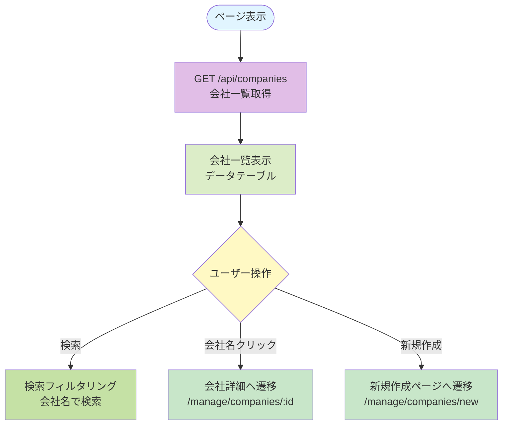
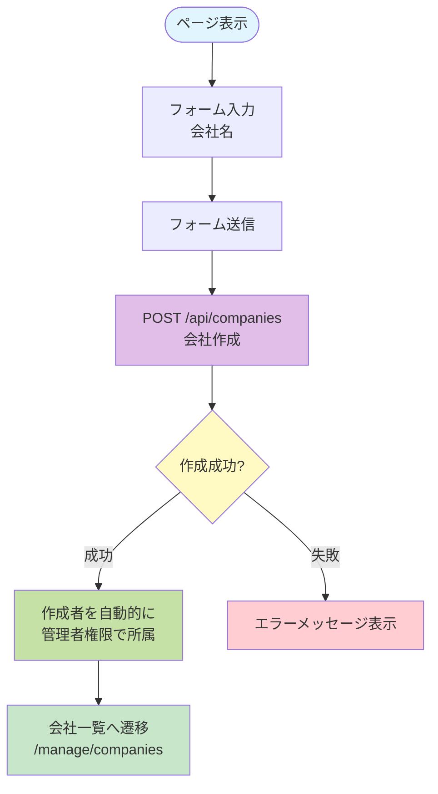
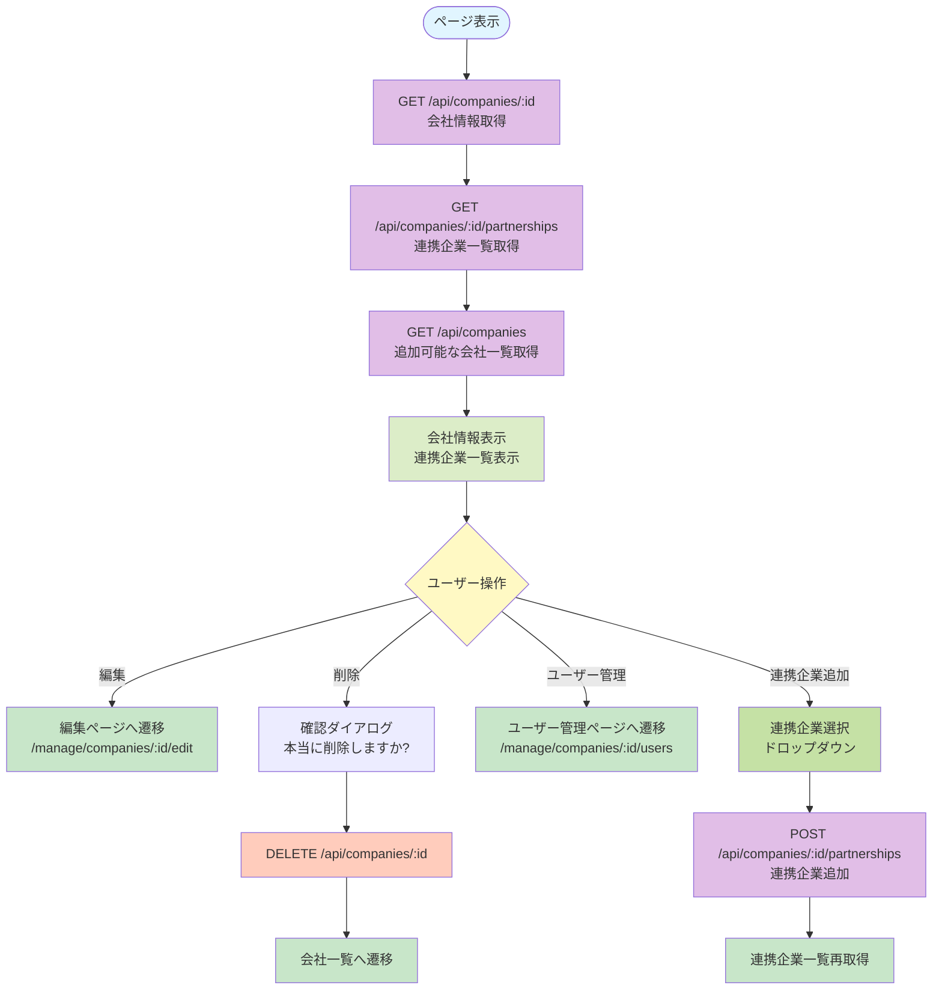
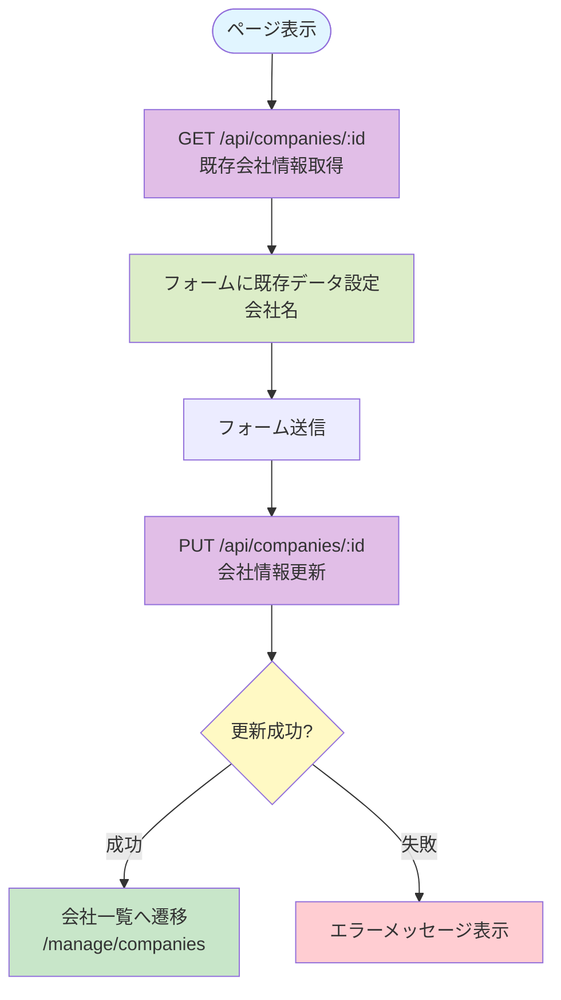
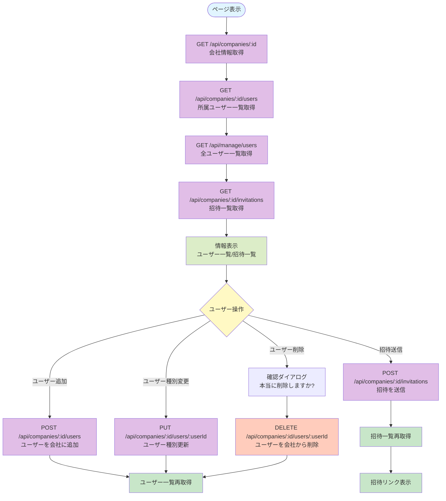

# 会社管理系ページ仕様書

## 概要

会社の作成、一覧表示、詳細表示、編集、ユーザー管理、パートナーシップ管理に関するページの機能仕様を記載します。

---

## 1. 会社一覧 (`/manage/companies`)

### 基本情報

- **ページパス**: `/manage/companies`
- **ファイル**: `pages/manage/companies/index.vue`
- **ミドルウェア**: `auth`（認証必須）
- **レイアウト**: `DashboardLayout`

### 主要機能

- 所属している会社一覧の表示
- 会社の検索
- 会社詳細へのリンク
- 新規会社作成へのリンク

### 処理フロー



### API呼び出し

#### GET /api/companies

**レスポンス**:
```json
[
  {
    "id": "company_id",
    "name": "会社名",
    "userType": 1,
    "createdAt": "2024-01-01T00:00:00Z"
  }
]
```

### 権限・アクセス制御

- 認証済みユーザーのみアクセス可能
- 所属している会社のみ表示される

### UI要素

- **検索ボックス**: 会社名で検索可能
- **データテーブル**:
  - 名前（会社詳細へのリンク）
  - ユーザー種別（バッジ表示）
  - 作成日
- **新規作成ボタン**: 常に表示

### エラーハンドリング

- 会社一覧取得失敗時はエラーメッセージを表示

### ユーザー種別表示

- 1: 管理者（defaultバッジ）
- 2: メンバー（secondaryバッジ）
- 3: パートナー（outlineバッジ）
- 4: 顧客（outlineバッジ）

---

## 2. 会社作成 (`/manage/companies/new`)

### 基本情報

- **ページパス**: `/manage/companies/new`
- **ファイル**: `pages/manage/companies/new.vue`
- **ミドルウェア**: `auth`（認証必須）
- **レイアウト**: `DashboardLayout`

### 主要機能

- 新規会社の作成
- 作成者は自動的に管理者権限で所属

### 処理フロー



### API呼び出し

#### POST /api/companies

**リクエスト**:
```json
{
  "name": "会社名"
}
```

**レスポンス**: 作成された会社情報

### 権限・アクセス制御

- 認証済みユーザーのみアクセス可能
- 作成者は自動的に管理者権限で所属

### UI要素

- **フォーム項目**:
  - 名前（必須、text型）
- **ボタン**:
  - 登録ボタン
  - キャンセルボタン（会社一覧へ戻る）

### エラーハンドリング

- 会社作成失敗時はエラーメッセージを表示

---

## 3. 会社詳細 (`/manage/companies/:id`)

### 基本情報

- **ページパス**: `/manage/companies/:id`
- **ファイル**: `pages/manage/companies/[id]/index.vue`
- **ミドルウェア**: `auth`（認証必須）
- **レイアウト**: `DashboardLayout`

### 主要機能

- 会社情報の表示
- 会社の削除
- 会社編集へのリンク
- ユーザー管理へのリンク
- 連携企業一覧の表示
- 連携企業の追加

### 処理フロー



### API呼び出し

#### GET /api/companies/:id

**レスポンス**:
```json
{
  "id": "company_id",
  "name": "会社名",
  "createdAt": "2024-01-01T00:00:00Z",
  "updatedAt": "2024-01-01T00:00:00Z"
}
```

#### GET /api/companies/:id/partnerships

**レスポンス**:
```json
[
  {
    "id": "partnership_id",
    "partnerCompanyId": "partner_company_id",
    "partnerCompanyName": "連携企業名",
    "createdAt": "2024-01-01T00:00:00Z"
  }
]
```

#### GET /api/companies

追加可能な会社一覧を取得（管理者権限を持つ会社のみ、現在の会社と既に連携している会社を除外）

#### POST /api/companies/:id/partnerships

**リクエスト**:
```json
{
  "partnerCompanyId": "partner_company_id"
}
```

**レスポンス**: 作成されたパートナーシップ情報

#### DELETE /api/companies/:id

会社を削除

### 権限・アクセス制御

- 認証済みユーザーのみアクセス可能
- 会社の編集・削除は管理者権限が必要（API側でチェック）

### UI要素

- **会社情報カード**:
  - ID
  - 作成日
  - 更新日
- **アクションボタン**:
  - 編集ボタン
  - 削除ボタン
- **ユーザー管理カード**:
  - ユーザー管理へのリンクボタン
- **連携企業セクション**:
  - 連携企業一覧（連携企業名、連携日）
  - 連携企業追加フォーム
    - 連携企業選択ドロップダウン
    - 追加ボタン

### エラーハンドリング

- 会社情報取得失敗時はエラーメッセージを表示
- 連携企業一覧取得失敗時はエラーメッセージを表示
- 追加可能な会社一覧取得失敗時はエラーメッセージを表示
- 連携企業追加失敗時はエラーメッセージを表示
- 削除失敗時はアラートでエラーメッセージを表示

### 連携企業追加の制約

- 追加可能な会社は、管理者権限を持つ会社のみ
- 現在の会社自身は選択不可
- 既に連携している会社は選択不可

---

## 4. 会社編集 (`/manage/companies/:id/edit`)

### 基本情報

- **ページパス**: `/manage/companies/:id/edit`
- **ファイル**: `pages/manage/companies/[id]/edit.vue`
- **ミドルウェア**: `auth`（認証必須）
- **レイアウト**: `DashboardLayout`

### 主要機能

- 会社情報の編集（名前のみ）

### 処理フロー



### API呼び出し

#### GET /api/companies/:id

既存の会社情報を取得

#### PUT /api/companies/:id

**リクエスト**:
```json
{
  "name": "会社名"
}
```

### 権限・アクセス制御

- 認証済みユーザーのみアクセス可能
- 会社の編集は管理者権限が必要（API側でチェック）

### UI要素

- **フォーム項目**:
  - 名前（必須、text型）
- **ボタン**:
  - 更新ボタン
  - キャンセルボタン（会社一覧へ戻る）

### エラーハンドリング

- 会社情報取得失敗時はエラーメッセージを表示
- 会社更新失敗時はエラーメッセージを表示

---

## 5. 会社ユーザー管理 (`/manage/companies/:id/users`)

### 基本情報

- **ページパス**: `/manage/companies/:id/users`
- **ファイル**: `pages/manage/companies/[id]/users.vue`
- **ミドルウェア**: `auth`（認証必須）
- **レイアウト**: なし（独自スタイル）

### 主要機能

- 会社に所属するユーザー一覧の表示
- ユーザーの追加（既存ユーザーから選択）
- ユーザー種別の変更
- ユーザーの削除
- 招待の送信
- 招待一覧の表示
- 招待リンクのコピー

### 処理フロー



### API呼び出し

#### GET /api/companies/:id

会社情報を取得

#### GET /api/companies/:id/users

**レスポンス**:
```json
[
  {
    "id": "user_company_id",
    "userId": "user_id",
    "companyId": "company_id",
    "userType": 1
  }
]
```

#### GET /api/manage/users

全ユーザー一覧を取得（追加用）

**レスポンス**:
```json
[
  {
    "id": "user_id",
    "email": "user@example.com",
    "name": "ユーザー名"
  }
]
```

#### GET /api/companies/:id/invitations

**レスポンス**:
```json
[
  {
    "id": "invitation_id",
    "email": "user@example.com",
    "userType": 1,
    "status": "PENDING",
    "expiresAt": "2024-12-31T23:59:59Z",
    "token": "invitation_token"
  }
]
```

#### POST /api/companies/:id/users

**リクエスト**:
```json
{
  "userId": "user_id",
  "userType": 1
}
```

#### PUT /api/companies/:id/users/:userId

**リクエスト**:
```json
{
  "userType": 1
}
```

#### DELETE /api/companies/:id/users/:userId

ユーザーを会社から削除

#### POST /api/companies/:id/invitations

**リクエスト**:
```json
{
  "email": "user@example.com",
  "userType": 1
}
```

**レスポンス**:
```json
{
  "invitationLink": "https://example.com/invitations/token"
}
```

### 権限・アクセス制御

- 認証済みユーザーのみアクセス可能
- 会社の管理者権限が必要（API側でチェック）

### UI要素

- **ユーザー追加セクション**:
  - ユーザー選択ドロップダウン（未所属ユーザーのみ表示）
  - ユーザー種別選択ドロップダウン
  - 追加ボタン
- **招待送信セクション**:
  - メールアドレス入力
  - ユーザー種別選択ドロップダウン
  - 送信ボタン
  - 招待リンク表示（送信成功後）
  - リンクコピーボタン
- **招待一覧セクション**:
  - 招待一覧テーブル
    - メールアドレス
    - 種別
    - ステータス
    - 有効期限
    - リンクコピーボタン
- **所属ユーザー一覧セクション**:
  - ユーザー一覧テーブル
    - ユーザーID
    - 名前（メールアドレス付き）
    - 種別（変更可能なドロップダウン）
    - 削除ボタン

### エラーハンドリング

- 会社情報取得失敗時はエラーメッセージを表示
- ユーザー一覧取得失敗時はエラーメッセージを表示
- 全ユーザー一覧取得失敗時はエラーメッセージを表示
- 招待一覧取得失敗時はエラーメッセージを表示
- ユーザー追加失敗時はアラートでエラーメッセージを表示
- ユーザー種別更新失敗時はアラートでエラーメッセージを表示
- ユーザー削除失敗時はアラートでエラーメッセージを表示
- 招待送信失敗時はアラートでエラーメッセージを表示

### ユーザー種別

- 1: 管理者
- 2: メンバー
- 3: パートナー
- 4: 顧客

### 招待ステータス

- PENDING: 保留中
- ACCEPTED: 承認済み
- REJECTED: 拒否済み
- EXPIRED: 期限切れ

### 招待リンク

- 招待送信成功後、招待リンクが表示される
- リンクをクリップボードにコピー可能
- 招待一覧からも各招待のリンクをコピー可能
- リンク形式: `https://example.com/invitations/:token`

