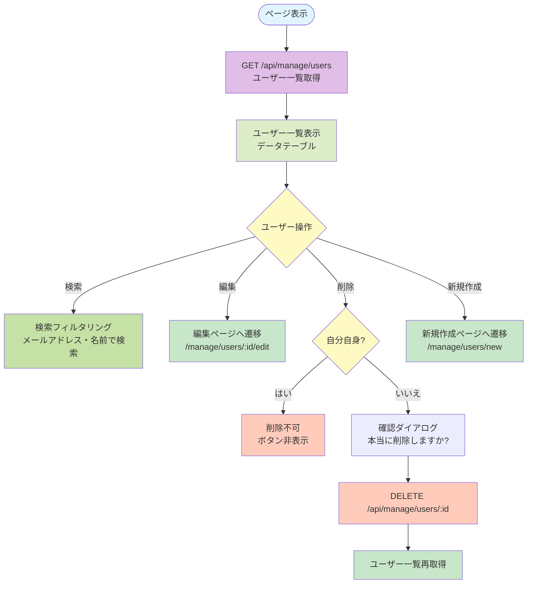
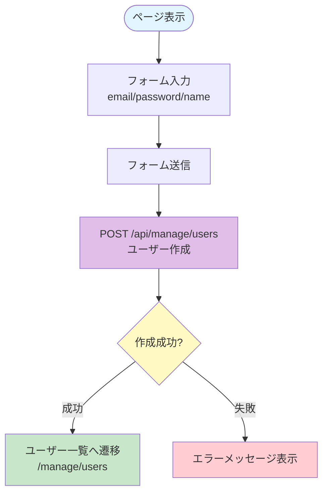
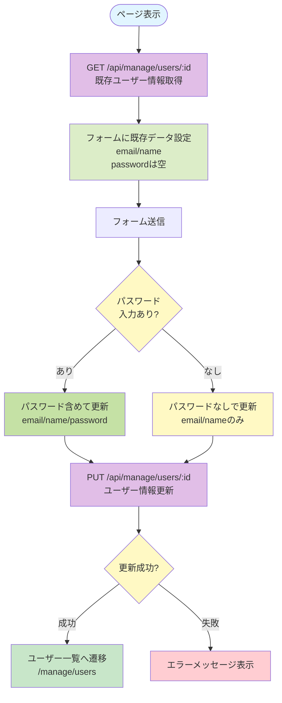

# ユーザー管理系ページ仕様書

## 概要

システム全体のユーザー管理に関するページの機能仕様を記載します。管理者権限が必要な機能です。

---

## 1. ユーザー一覧 (`/manage/users`)

### 基本情報

- **ページパス**: `/manage/users`
- **ファイル**: `pages/manage/users/index.vue`
- **ミドルウェア**: `admin`（管理者権限必須）
- **レイアウト**: `DashboardLayout`

### 主要機能

- システム全体のユーザー一覧の表示
- ユーザーの検索
- ユーザー編集へのリンク
- ユーザーの削除（自分自身は削除不可）
- 新規ユーザー作成へのリンク

### 処理フロー



### API呼び出し

#### GET /api/manage/users

**レスポンス**:
```json
[
  {
    "id": "user_id",
    "email": "user@example.com",
    "name": "ユーザー名",
    "userType": 1,
    "createdAt": "2024-01-01T00:00:00Z"
  }
]
```

#### DELETE /api/manage/users/:id

ユーザーを削除

### 権限・アクセス制御

- 管理者権限が必要（`admin`ミドルウェア）
- 自分自身は削除不可（削除ボタンが表示されない）

### UI要素

- **検索ボックス**: メールアドレス・名前で検索可能
- **データテーブル**:
  - 名前
  - メールアドレス
  - 種別（バッジ表示）
  - 作成日
  - 操作（編集ボタン、削除ボタン）
- **新規作成ボタン**: 常に表示

### エラーハンドリング

- ユーザー一覧取得失敗時はエラーメッセージを表示
- 削除失敗時はアラートでエラーメッセージを表示

### ユーザー種別表示

- 1: 管理者（defaultバッジ）
- 2: メンバー（secondaryバッジ）
- 3: パートナー（outlineバッジ）
- 4: 顧客（outlineバッジ）

---

## 2. ユーザー作成 (`/manage/users/new`)

### 基本情報

- **ページパス**: `/manage/users/new`
- **ファイル**: `pages/manage/users/new.vue`
- **ミドルウェア**: `admin`（管理者権限必須）
- **レイアウト**: `DashboardLayout`

### 主要機能

- 新規ユーザーの作成
- メールアドレス、パスワード、名前の入力

### 処理フロー



### API呼び出し

#### POST /api/manage/users

**リクエスト**:
```json
{
  "email": "user@example.com",
  "password": "password123",
  "name": "ユーザー名"
}
```

**レスポンス**: 作成されたユーザー情報

### 権限・アクセス制御

- 管理者権限が必要（`admin`ミドルウェア）

### UI要素

- **フォーム項目**:
  - メールアドレス（必須、email型）
  - パスワード（必須、password型、8文字以上）
  - 名前（必須、text型）
- **ボタン**:
  - 登録ボタン
  - キャンセルボタン（ユーザー一覧へ戻る）

### エラーハンドリング

- ユーザー作成失敗時はエラーメッセージを表示

---

## 3. ユーザー編集 (`/manage/users/:id/edit`)

### 基本情報

- **ページパス**: `/manage/users/:id/edit`
- **ファイル**: `pages/manage/users/[id]/edit.vue`
- **ミドルウェア**: `admin`（管理者権限必須）
- **レイアウト**: `DashboardLayout`

### 主要機能

- ユーザー情報の編集
- メールアドレス、パスワード、名前の変更
- パスワードは変更する場合のみ入力

### 処理フロー



### API呼び出し

#### GET /api/manage/users/:id

既存のユーザー情報を取得

**レスポンス**:
```json
{
  "id": "user_id",
  "email": "user@example.com",
  "name": "ユーザー名"
}
```

#### PUT /api/manage/users/:id

**リクエスト**（パスワード変更する場合）:
```json
{
  "email": "user@example.com",
  "password": "new_password",
  "name": "ユーザー名"
}
```

**リクエスト**（パスワード変更しない場合）:
```json
{
  "email": "user@example.com",
  "name": "ユーザー名"
}
```

### 権限・アクセス制御

- 管理者権限が必要（`admin`ミドルウェア）

### UI要素

- **フォーム項目**:
  - メールアドレス（必須、email型）
  - パスワード（任意、password型、8文字以上、変更する場合のみ入力）
  - 名前（必須、text型）
- **ボタン**:
  - 更新ボタン
  - キャンセルボタン（ユーザー一覧へ戻る）

### エラーハンドリング

- ユーザー情報取得失敗時はエラーメッセージを表示
- ユーザー更新失敗時はエラーメッセージを表示

### パスワード変更の扱い

- パスワードフィールドは任意入力
- パスワードが入力されている場合のみ、リクエストに含めて更新
- パスワードが空の場合は、パスワードを更新しない

